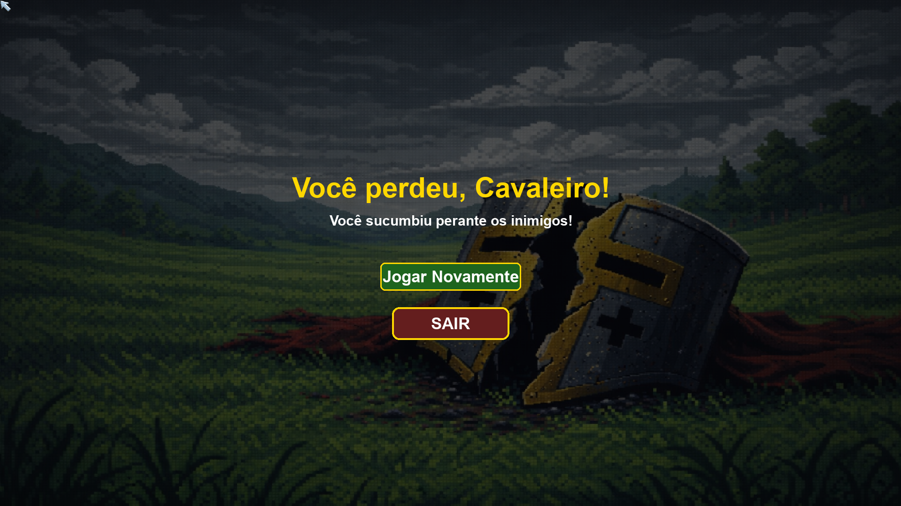

# A Lenda da Cruzada
## Membros do Grupo
Renan Feliciano (rafms)  
Eduardo Belian (eclb)  
Miguel Henrique (mhrs)  
Yuri Oliveira (yao)  
Sávio Rikelme (srfn)  
## Imagens
  
  
  
## Arquitetura do Projeto
PROJETO_IP  
- ├──audios --- arquivos de audio  
- ├──sprites --- arquivos das imagens que se movem  
  - ├──Boss  
  - ├──hud  
  - ├──templario
  - ├──inimigos  
  - ├──itens  
  - ├──cursor  
- ├──telas --- arquivos de imagens das telas  
- ├──coletaveis --- funções dos itens coletáveis  
- ├──cruzado --- funções do perosnagem jogável  
- ├──hud --- funções do hud   
- ├──inimigos --- funções dos inimigos mais basicos  
- ├──boss --- funções do boss final  
- ├──Main --- funções principais que fazem o jogo ser executado  
## Ferramentas Utilizadas
* Criação dos sprites: Pixilart
* Criação do Mapa: https://kenney.nl/assets/tiny-town
* Criação das imagens dos menus: ChatGPT
## Divisão do Trabalho
* Renan Feliciano - Criação dos sprites e imagens presentes no jogo  
* Eduardo Belian - HUD de coletáveis e Criação do mapa do jogo  
* Miguel Henrique - correção de bugs, e correção de sistema de colisão e spawn dos inimigos, música de background, sons de alguns inimigos  
* Yuri Oliveira -  criação do spawn dos itens, sistema de contagem de pontos e menu  
* Sávio Rikelme - implementação das telas de morte e vitória, sons de alguns inimigos
## Conceitos Aprendidos em Aula
* Laços de repetição  
* Funções  
* Condicionais  
* Arrays  
## Desafios Enfrentados
Otimização de desempenho
Organização dos códigos em equipe
Colisão dos objetos
Spawn dos itens e dos inimigos
Comportamento dos inimigos
Bugs com alguns sprites
Problemas de escalas com os objetos.
### Lições Aprendidas
Aprendemos o uso do GitHub, para trabalhar em grupo, enviar atualizações no código e divisão de tarefas. Aprendemos o uso das classes em Python e a utilizar a bibliotecama PyGame.
